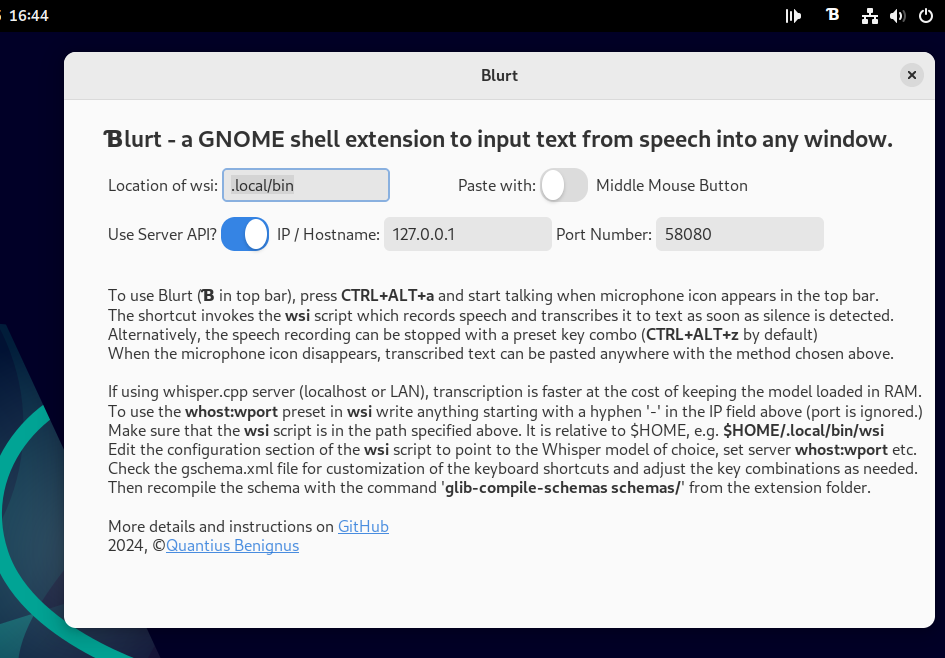

#  Blurt - a Gnome shell extension for accurate speech-to-text input in Linux </img>

(**For a leaner tool working across all desktop environments, check also [Blah Speech to Text](https://github.com/QuantiusBenignus/blahst).**)

**Blurt**  is a simple Gnome shell extension based on the command line utility [NoteWhispers](https://github.com/quantiusbenignus/NoteWhispers), which itself, is built around the great [whisper.cpp](https://github.com/ggerganov/whisper.cpp).
The current code in `main` is tested on and supports ver. 48 (and likely 46 and 47) of the Gnome shell. For older versions, see the respective folders (releases) or go to the [GNOME extensions website](https://extensions.gnome.org/extension/6742/blurt/).  

[](https://extensions.gnome.org/extension/6742/blurt/)
**Features:**
- **Can use local whisper.cpp installation**
- **Or transcribe with a whisper.cpp server** -[speedier and recommended](./NET_TRANSCRIBE.md).
- **Right click for preferences and setup**
- **Start/Stop speech-to-text input with a set of key bindings**
- **Start/Stop speech-to-text input with a left click on the icon**
- **Icon color shows status during operation**
- **NEW. Option to transcribe with a [whisperfile](https://github.com/QuantiusBenignus/blurt?tab=readme-ov-file#whisperfile-inference)**

**UPDATE: GNOME SHELL version 48 is now supported in the main branch**. If installing directly from the [GNOME extensions website](https://extensions.gnome.org/extension/6742/blurt/), please, **get the "wsi" script from this repository** The unified functionality script `wsi` in the master branch is in sync with versions 6 and 8 of the extension published at [GNOME extensions](https://extensions.gnome.org/extension/6742/blurt/).

When Blurt is enabled (indicated with &#x1E04; in the top bar), one can input text from speech into any editable field (such as the text editor in the screencast below). This is done by pressing a key combination (<CTRL+ALT+a> is the default), triggering a speech recognizer process that records a speech clip from the microphone, transcribes it with whisper.cpp and sends the result to the PRIMARY selection or Clipboard under X11 or Wayland.
When recording speech, a microphone indicator appears in the top bar and the color of the extension indicator &#x1E04; becomes yellow.
The disappearance of the microphone icon from the top bar indicates that the recognizer has "blurted" a snippet of text that can be pasted with the middle mouse button. (Note that on slower systems there may be a slight delay after the microphone icon disappears and before the text reaches the clipboard due to the time needed for transcription. On my computer it is less than 300 ms for an average paragraph of spoken text).

The convenience that this extension affords is demonstrated in this screencast (note the microphone icon at the top when recording):

[//]: # (https://github.com/QuantiusBenignus/blurt/assets/120202899/b05f0829-1f45-40ec-853c-4cadb43a403e)

<video width="424" height="240" src="https://github.com/QuantiusBenignus/blurt/assets/120202899/0b83afab-c537-404c-a085-96a7c1167961"></video>
#### Basic UI:
|Action|Hotkey|Mouse|
|----|----|----|
|START RECORDING| hotkey (e.g. <CTRL+ALT+a>) | MB1 (left) click Ḅ indicator|
|STOP RECORDING| hotkey (e.g. <CTRL+ALT+z> | MB1 (left) click Ḅ indicator|
|PREFERENCES| |MB3 (right) click Ḅ indicator|
|PASTE TEXT|with <CTRL+V> when set  or| MB2 (middle) click in text area|
|AUTOPASTE TEXT|on STOP RECORDING|Automatic w. xdotool|

### SYSTEM SETUP

#### PREREQUISITES:
- zsh or bash command line shell installation on a Linux system running GNOME.   
- working whisper.cpp installation (see https://github.com/ggerganov/whisper.cpp or a downloaded [whisperfile](https://huggingface.co/Mozilla/whisperfile)
- recent versions of `sox`, `xsel`, `curl` (or `wl-copy` for Wayland)  command-line tools from your system's repositories.
-  A working microphone 
> *DISCLAIMER: Some of the proposed actions, if implemented, will alter how your system works internally (e.g. systemwide temporary file storage and memory management). The author neither takes credit nor assumes any responsibility for any outcome that may or may not result from interacting with the contents of this document. Suggestions in this section are based on the author's choice and opinion and may not fit the taste or the particular situation of everyone; please, adjust as you like.*

#### "INSTALLATION"

* The extension can be installed either from https://extensions.gnome.org/extension/6742/blurt/ with one-click install, or manually by clonning this repository (or just grabbing the zip archive).
If you are installing the Blurt GNOME extension manually, place the extracted folder `blurt@quantiousbenignus.local` into `$HOME/.local/share/gnome-shell/extensions` and enable it from your `Extensions` system app or from the command line with
```
gnome-extensions enable blurt@quantiusbenignus.local
```
 provided that it is detected by the system, which can be checked by inspecting the output of 
 ```
 gnome-extensions list
```

* Place the orchestrator script **wsi**  in $HOME/.local/bin/ ([also handles connection to a wisper.cpp server](./NET_TRANSCRIBE.md) or a [whisperfile](https://huggingface.co/Mozilla/whisperfile))
```
 cp -t $HOME/.local/bin wsi
```
* Make it executable:
```
  cd $HOME/.local/bin; chmod +x wsi
```

* Set up at least one of the inference engines:
 
##### Inference with `whisper-cli` or `whisper-server`
*(Assuming whisper.cpp is installed and the "whisper-cli" and "whisper-server" executables compiled in the cloned whisper.cpp repo. See Prerequisites section)*
* If using local whisper.cpp, create a symbolic link (the code expects 'transcribe' in your $PATH) to the compiled "whisper-cli" executable in the whisper.cpp directory.
  For example, create it in your `$HOME/.local/bin/` (part of your $PATH) with 
```
ln -s /full/path/to/whisper.cpp/build/bin/whisper-cli $HOME/.local/bin/transcribe
#The same can be done for the whisper-server:
ln -s /full/path/to/whisper.cpp/build/bin/whisper-server $HOME/.local/bin/whserver
#The previous exacutables `main` and `server` have been renamed/deprecated
```
If transcribe is not in your $PATH, either edit the call to it in **wsi** to include the absolute path, or add its location to the $PATH variable. Otherwise the script and by extension, the extension:-) will fail.

##### Whisperfile Inference
If installing/compiling whisper.cpp seems like a dounting task, one can simply download a [whisperfile](https://huggingface.co/Mozilla/whisperfile), an actually portable executable from the [llamafile project](https://github.com/Mozilla-Ocho/llamafile), that works on most platforms and contains both the inference engine (whisper.cpp variant) and an embedded whisper model file. All one needs to do is place the whisperfile somewhere in the PATH and make it executable. For example:
```
mv whisper-tiny.en.llamafile ~/.local/bin/
chmod +x ~/.local/bin/whisper-tiny.en.llamafile
```
The small cost to pay when using a whisperfile is that a compiled whisper.cpp will run inference faster (especially if compiled with full GPU support). The `wsi` scriptis set up in such a way that if the $WHISPERFILE variable in its CONFIG section is uncommented and points to a valid executable whisperfile (either full path to it or a qualified name in the PATH), the script will attempt first to perform transcription with the whisperfile. The whisper.cpp inference becomes the fallback option. Commenting out the $WHISPERFILE variable will revert to inference with whisper.cpp's `whisper-cli` or `whisper-server`.   

* Configure the script to match your environment (see CONFIGURATION section below).
* Run once from the command line to let the script check for required dependencies.  

##### CONFIGURATION
Inside the **wsi** script, near the begining, there is a clearly marked section, named **"USER CONFIGURATION BLOCK"** where all the user-configurable variables (described in the following section) have been collected. 
Most can be left as is but the important ones are the location of the whisper.cpp model file that you would like to use during transcription and/or the fallback network address and port of the whisper.cpp server.
The location of the **wsi** script (should be in your $PATH) can be changed from the "Preferences" dialog, accessible by the system `Extensions` app or by right-clicking on the `Blurt` (&#x1e04;) top bar indicator label.


The keyboard shortcut to initiate speech input can also be modified if necessary. Check the gschema.xml file for the key combination and adjust as desired. The schema then has to be recompiled with 

```
cd ~/.local/share/gnome-shell/extensions/blurt@quantiusbenignus.local/
glib-compile-schemas schemas/
```

from the command line in the extension folder.

The extension should now be fully functional.

#### TIPS AND TRICKS
Sox is recording in wav format at 16k rate, the only currently accepted by whisper.cpp. This is done in **wsi** with this command:
`rec -t wav $ramf rate 16k silence 1 0.1 3% 1 2.0 6% `
It will attempt to stop on silence of 2s with signal level threshold of 6%. A very noisy environment will prevent the detection of silence and the recording (of noise) will continue. This is a problem and a remedy that may not work in all cases is to adjust the duration and silence threshold in the sox filter in the `wsi` script. 
**You can use the manual interuption method below if preferred - now built in the extension itself**

You can't raise the threshold arbitrarily because, if you consistently lower your voice (fadeout) at the end of your speech, it may get cut off if the threshold is high. Lower it in that case to a few %.    
It is best to try to make the speech distinguishable from noise by amplitude (speak clearly, close to the microphone), while minimizing external noise (sheltered location of the microphone, noise canceling hardware etc.)
With good speech signal level, the threshold can then be more effective, since SNR (speech-to-noise ratio:-) is effectively increased. 

##### Manual speech recording interuption (built-in in the latest version of Blurt - no need to set up, CTRL+ALT+z is default)
For those who want to be able to interupt the recording manually with a key combination, in the spirit of great hacks, we will not even try to rewrite the extension code because... "kiss".
Instead of writing javascript to fight with shell setups and edge cases when transfering signals from the GNOME shell to a Gio.subprocess in a new bash or zsh shell etc., we are going to, again, use the system built-in features:
* Open your GNOME system settings and find "Keyboard".
* Under "Keyboard shortcuts", "View and customize shortcuts"
* In the new window, scroll down to "Custom Shortcuts" and press it.
* Press "+" to add a new shortcut and give it a name: "Blurt it already!"
* In the "Command" field type `pkill --signal 2 rec`
* Then press "Set Shortcut" and select a (unused) key combination. For example CTRL+ALT+x
* Click Add and you are done. 
That Simple.  Just make sure that the new key binding has not been set-up already for something else.
Now when the extension is recording speech, it can be stopped with the new key combo and transcription will start immediatelly.

For the minimalists, it is trivial to extrapolate from this hack to a complete CLI solution, without a single pixel of GUI video buffering.
(A simple Adwaita widget window can cost MBs of video memory) 
Enter [BlahST](https://github.com/QuantiusBenignus/blahst/) - this more universal, lightweight tool configured for client-server transcription, has replaced Blurt completely for me.

After the speech is captured, it will be passed to `transcribe` (whisper.cpp) for speech recognition. This will happen faster than real time (especially with a fast CPU or if your whisper.cpp installation uses CUDA). One can adjust the number of processing threads used by adding  `-t n` to the command line parameters of transcribe (please, see whisper.cpp documentation). 
The script will then parse the text to remove non-speech artifacts, format it and send it to the PRIMARY selection (clipboard) using either X11 or Wayland tools. 

In principle, whisper (whisper.cpp) **is multilingual** and with the correct model file, this extension will "blurt" out UTF-8 text transcribed in the correct language. In the wsi script, the language choice can be made permanent by using `-l LC` in the `transcribe` call, where LC stands for the language code of choice, for example `-l fr` for french. 

##### Temporary directory and files
Speech-to-text transcription is memory- and CPU-intensive task and fast storage for read and write access can only help. That is why **wsi** stores temporary and resource files in memory, for speed and to reduce SSD/HDD "grinding": `TEMPD='/dev/shm'`. 
This mount point of type "tmpfs" is created in RAM (let's assume that you have enough, say, at least 8GB) and is made available by the kernel for user-space applications. When the computer is shut down it is automatically wiped out, which is fine since we do not need the intermediate files.
In fact, for some types of applications (looking at you Electron), it would be beneficial (IMHO) to have the systemwide /tmp mount point also kept in RAM. Moving /tmp to RAM may speed up application startup a bit. A welcome speedup for any Electron app. In its simplest form, this transition is easy, just run:

`echo "tmpfs /tmp tmpfs rw,nosuid,nodev" | sudo tee -a /etc/fstab`
and then restart your Linux computer.
For the aforementioned reasons, especially if HDD is the main storage media, one can also move the ASR model files needed by whisper.cpp in the same location (/dev/shm). These are large files, that can be transferred to this location at the start of a terminal session (or at system startup). This can be done using your `.profile` file by placing something like this in it: 
```
([ -f /dev/shm/ggml-base.en.bin ] || cp /path/to/your/local/whisper.cpp/models/ggml* /dev/shm/)
```

At this stage the extension, while useful, is somewhat of a "convenience hack" and can be improved by a seasoned GNOME developer who may find a better way to invoke whisper.cpp and fill the clipboard.
A virtual keyboard device implementing a legitimate IBus input method to send the text to a target text field is another direction for improvement, although I have no idea how to spy the field in focus, outside of the hacky nature of `xdotoll` and such.

#### Credits
* Open AI (for [Whisper](https://github.com/openai/whisper))
* Georgi Gerganov and community ( for Whisper's C/C++ port [whisper.cpp](https://github.com/ggerganov/whisper.cpp))
* The **sox** developers (for the venerable "Swiss Army knife of sound processing tools")
* The creators and maintainers of GNOME and utilities such as **xsel, xclip, wl-copy**, the heaviweight **ffmpeg** and others that make the Linux environment (CLI and GUI) such a powerful paradigm.
