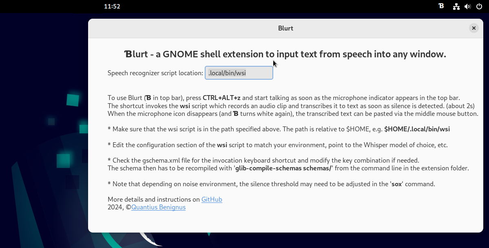

# Blurt - a Gnome shell extension for accurate speech input in Linux

**Blurt**  is a very simple Gnome shell extension based on the command line utility [NoteWhispers](https://github.com/quantiusbenignus/NoteWhispers), which itself, is built around the great [whisper.cpp](https://github.com/ggerganov/whisper.cpp).
It is confirmed to work under version 43 of the GNOME shell (the current version on my Linux system).  

When the extension is installed and enabled (indicated with &#x0181; in the top bar), one can input text from speech into any window that has the keyboard focus (such as the text editor in the screencast below). This is done by pressing a key combination (<CTRL+ALT+z> is the default) , triggering a speech recognizer process that records a speech clip from the microphone, transcribes it with whisper.cpp and sends the result to the PRIMARY selection/clipboard under X11 or Wayland.
When speech input is initiated, a microphone indicator icon appears in the top bar and is shown for the duration of the recording.
The disappearance of the microphone icon from the top bar indicates that the process is completed and the extension has "blurted" a snippet of text that can be pasted with the middle mouse button. (Note that on slower systems there may be a slight delay after the microphone icon disappears and before the text reaches the clipboard due to the time needed for transcription. On my computer it is less than 300 ms for an average paragraph of spoken text).

The convenience that this extension affords is demonstrated in this screencast:
https://github.com/QuantiusBenignus/blurt/assets/120202899/b05f0829-1f45-40ec-853c-4cadb43a403e


#### SYSTEM SETUP

##### PREREQUISITES:
- zsh or bash command line shell installation on a LInux system running GNOME.   
- whisper.cpp installation (see https://github.com/ggerganov/whisper.cpp) 
- recent versions of 'sox', 'xsel' or 'wl-copy'  command-line tools from your system's repositories.
-  A working microphone 
> *DISCLAIMER: Some of the proposed actions, if implemented, will alter how your system works internally (e.g. systemwide temporary file storage and memory management). The author neither takes credit nor assumes any responsibility for any outcome that may or may not result from interacting with the contents of this document. Suggestions in this section are based on the author's choice and opinion and may not fit the taste or the particular situation of everyone; please, adjust as you like.*

##### "INSTALLATION"
*(Assuming whisper.cpp is available and the "main" executable compiled with 'make' in the cloned whisper.cpp repo. See Prerequisites section)*
* Place the script **wsi** in $HOME/.local/bin  ( **It is advisable to run this script once from the command line to let it check for its dependencies** )
* Create a symbolic link (the code expects 'transcribe' in your PATH) to the compiled "main" executable in the whisper.cpp directory. For example, create it in your `$HOME/.local/bin`  with 
```ln -s /full/path/to/whisper.cpp/main $HOME/.local/bin/transcribe```.
 * If you are installing the Blurt GNOME extension manually, place the extracted folder `blurt@quantiousbenignus.local` into `$HOME/.local/share/gnome-shell/extensions` and enable it from your `Extensions` system app or from the command line with ```gnome-extensions enable blurt@quantiusbenignus.local```, provided that it is detected by the system, which can be checked by inspecting the output of `gnome-extensions list`
 
##### CONFIGURATION
Inside the **wsi** script, near the begining, there is a clearly marked section, named **"USER CONFIGURATION BLOCK"**, where all the user-configurable variables (described in the following section) have been collected. Most can be left as is.

The location of the **wsi** script can be changed from the "Preferences" dialog, accessible by the system `Extensions` app or by clicking on the `Blurt` top bar indicator label.

The keyboard shortcut to initiate speech input can also be modified if necessary. Check the gschema.xml file for the key combination and modify it as desired. The schema then has to be recompiled with `glib-compile-schemas schemas/` from the command line in the extension folder

##### Notes
Sox is recording in wav format at 16k rate, the only currently accepted by whisper.cpp:
`rec -t wav $ramf rate 16k silence 1 0.1 3% 1 2.0 7% `
It will attempt to stop on silence of 2s with signal level threshold of 7%. A very noisy environment will prevent the detection of silence and the recording (of noise) will continue. This is a probelm and a remedy that may not work in all cases is to adjust the duration and level threshold in the soz filter above. 
After the speech is captured, it will be passed to `transcribe` (whisper.cpp) for speech recognition. This will happen faster than real time (especiall with fast CPU or if your whisper.cpp installation uses CUDA). One can adjust the number of processing threads used by adding  `-t n` to the command line parameters of transcribe (please, see whisper.cpp documentation). 
The script will then parse the text to remove non-speech artifacts and send it to the PRIMARY clipboard using either X11 or Wayland tools. 

##### Temporary directory and files
Audio-to-text transcription is memory- and CPU-intensive task and fast storage for read and write access can only help. That is why **wsi** stores temporary and resource files in memory, for speed and to reduce SSD/HDD "grinding": `TEMPD='/dev/shm'`. 
This mount point of type "tmpfs" is created in RAM (let's assume that you have enough, say, at least 8GB) and is made available by the kernel for user-space applications. When the computer is shut down it is automatically wiped out, which is fine since we do not need the intermediate files.
In fact, for many applications that are stored in Appimage format, it would be beneficial (IMHO) to have the systemwide /tmp mount point also kept in RAM. Moving /tmp to RAM may speed up application startup a bit. A welcome speedup for any Electron app.  In its simplest form, this transition is easy, just run:
`echo "tmpfs /tmp tmpfs rw,nosuid,nodev" | sudo tee -a /etc/fstab`
and then restart your Linux computer.
For the aforementioned reasons, especially if HDD is the main storage media, one can also move the ASR model files needed by whisper.cpp in the same location (/dev/shm). These are large files, that can be transferred to this location at the start of a terminal session (or at system startup). This can be done using your .profile file by placing something like this in it: 
```
([ -f /dev/shm/ggml-base.en.bin ] || cp /path/to/your/local/whisper.cpp/models/ggml* /dev/shm/)
```

### Credits
* Open AI (for [Whisper](https://github.com/openai/whisper))
* Georgi Gerganov and community ( for Whisper's C/C++ port [whisper.cpp](https://github.com/ggerganov/whisper.cpp))
* The **sox** developers (for the venerable "Swiss Army knife of sound processing tools")
* The creators and maintainers of GNOME and utilities such as **xsel, xclip, wl-copy**, the heaviweight **ffmpeg** and others that make the Linux environment (CLI and GUI) such a powerful paradigm.
